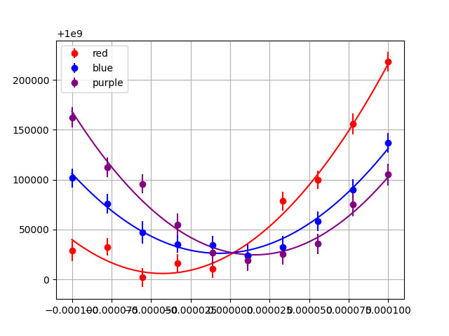
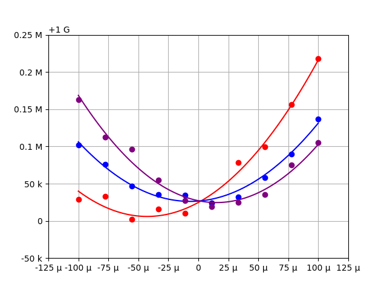

Examples
########

Plotting and Tabulating Fit Data
================================

We are given 3 data sets which share the same x data

::

    x = [-0.0001, -7.777777777777778e-05, -5.555555555555556e-05, -3.3333333333333335e-05, -1.1111111111111112e-05, 1.1111111111111112e-05, 3.3333333333333335e-05, 5.555555555555556e-05, 7.777777777777778e-05, 0.0001]
    y0 = [1000028705.1993496, 1000032562.3072652, 1000001896.3076739, 1000015911.7068863, 1000010552.1178038, 1000024250.5937256, 1000078382.654146, 1000099609.1405739, 1000156104.3810261, 1000218228.6977944]
    y0_err = [10074.736165669336, 8935.559150444922, 9783.419334631266, 9603.772217328124, 8958.492409007613, 9691.25932834366, 9465.18285498962, 9252.428221037011, 10506.00188280341, 9674.67988710319]
    y1 = [1000101738.923473, 1000075626.403057, 1000047095.4124904, 1000035342.0517923, 1000034627.8667482, 1000024117.4097912, 1000032427.2038687, 1000058361.2708515, 1000090132.8138337, 1000137137.590938]
    y1_err = [9546.933912908422, 9865.10610577111, 11233.801341794, 8709.471433431938, 9260.554239646424, 11037.621922605267, 11397.162303260564, 10037.634586482105, 10076.884695349665, 9877.999777816845]
    y2 = [1000162524.5101302, 1000112400.2588283, 1000095882.1735442, 1000055167.7660033, 1000026965.91884, 1000019054.4158406, 1000025166.114796, 1000035728.0662737, 1000075468.031305, 1000105069.4047513]
    y2_err = [10476.46500331082, 10086.821923665966, 9559.819918015002, 10775.7594031851, 11296.833796893989, 10205.878907138671, 10025.395431977211, 10091.52840469254, 11880.794221192386, 10936.463066427263]

We would like to perform quadratic fits to these data sets, visualize
the results, and print the best fit parameters including the uncertainty
reported by the fit routine.
For these tasks we will require the ``numpy``, ``scipy``,
``matplotlib``, and ``tabulate`` packages.
Without ``sciform`` we can perform the fit and plot the data and best
fit lines and print out a table of best fit parameters and
uncertainties::

    import numpy as np
    import matplotlib.pyplot as plt
    from scipy.optimize import curve_fit
    from tabulate import tabulate

    x = [-0.0001, -7.777777777777778e-05, -5.555555555555556e-05, -3.3333333333333335e-05, -1.1111111111111112e-05, 1.1111111111111112e-05, 3.3333333333333335e-05, 5.555555555555556e-05, 7.777777777777778e-05, 0.0001]
    y0 = [1000028705.1993496, 1000032562.3072652, 1000001896.3076739, 1000015911.7068863, 1000010552.1178038, 1000024250.5937256, 1000078382.654146, 1000099609.1405739, 1000156104.3810261, 1000218228.6977944]
    y0_err = [10074.736165669336, 8935.559150444922, 9783.419334631266, 9603.772217328124, 8958.492409007613, 9691.25932834366, 9465.18285498962, 9252.428221037011, 10506.00188280341, 9674.67988710319]
    y1 = [1000101738.923473, 1000075626.403057, 1000047095.4124904, 1000035342.0517923, 1000034627.8667482, 1000024117.4097912, 1000032427.2038687, 1000058361.2708515, 1000090132.8138337, 1000137137.590938]
    y1_err = [9546.933912908422, 9865.10610577111, 11233.801341794, 8709.471433431938, 9260.554239646424, 11037.621922605267, 11397.162303260564, 10037.634586482105, 10076.884695349665, 9877.999777816845]
    y2 = [1000162524.5101302, 1000112400.2588283, 1000095882.1735442, 1000055167.7660033, 1000026965.91884, 1000019054.4158406, 1000025166.114796, 1000035728.0662737, 1000075468.031305, 1000105069.4047513]
    y2_err = [10476.46500331082, 10086.821923665966, 9559.819918015002, 10775.7594031851, 11296.833796893989, 10205.878907138671, 10025.395431977211, 10091.52840469254, 11880.794221192386, 10936.463066427263]

    def quadratic(x, c, x0, y0):
        return (c/2) * (x-x0)**2 + y0

    model_x = np.linspace(min(x), max(x), 100)
    color_list = ['red', 'blue', 'purple']
    fig, ax = plt.subplots(1, 1)

    fit_results_list = list()

    for idx, (y, yerr) in enumerate(((y0, y0_err), (y1, y1_err), (y2, y2_err))):
        fit_results_dict = dict()
        color = color_list[idx]
        ax.errorbar(x, y, yerr, marker='o', linestyle='none', color=color, label=color)

        popt, pcov = curve_fit(quadratic, x, y, sigma=yerr, p0=(2e13, 0, 1e9))
        plt.plot(model_x, quadratic(model_x, *popt), color=color)

        fit_results_dict['curvature'] = popt[0]
        fit_results_dict['curvature_err'] = np.sqrt(pcov[0, 0])

        fit_results_dict['x0'] = popt[1]
        fit_results_dict['x0_err'] = np.sqrt(pcov[1, 1])

        fit_results_dict['y0'] = popt[2]
        fit_results_dict['y0_err'] = np.sqrt(pcov[2, 2])

        fit_results_list.append(fit_results_dict)

    ax.grid(True)
    ax.legend()
    plt.show()
    print(tabulate(fit_results_list, tablefmt='grid', headers='keys', floatfmt='#.2g'))

This produces the plot:

And the table::

    +-------------+-----------------+----------+----------+---------+----------+
    |   curvature |   curvature_err |       x0 |   x0_err |      y0 |   y0_err |
    +=============+=================+==========+==========+=========+==========+
    |     2.1e+13 |         1.9e+12 | -4.3e-05 |  4.8e-06 | 1.0e+09 |  4.6e+03 |
    +-------------+-----------------+----------+----------+---------+----------+
    |     1.8e+13 |         1.0e+12 | -6.9e-06 |  1.6e-06 | 1.0e+09 |  2.9e+03 |
    +-------------+-----------------+----------+----------+---------+----------+
    |     2.2e+13 |         1.7e+12 |  1.5e-05 |  2.5e-06 | 1.0e+09 |  4.4e+03 |
    +-------------+-----------------+----------+----------+---------+----------+

This plot and table suffer from a number of shortcomings which impede
human readability.
One issue is that the exponents for the values and uncertainties differ
making it hard to identify the significant digits of the value.
Another issue is that the exponents also vary from one dataset to the
next, but it hard to see these differences at a glance.
Of course, we could make manual adjustments to improve both the plot and
the table.
However, :mod:`sciform` will allow us to make the required changes in a
general and automated way.

We can address these problems using :mod:`sciform` by:

#. Using prefix scientific notation to label the plot axes
#. Using value/uncertainty formatting to collapse the value and errors
   into the same table column and to make obvious the relative scale
   between the uncertainty and value. In this case we will use the
   bracket uncertainty format.

To do this we import :mod:`sciform` and make some helper functions for
displaying the plot axes as described::

    from typing import Literal
    import re

    import numpy as np
    import matplotlib.pyplot as plt
    from scipy.optimize import curve_fit
    from tabulate import tabulate

    from sciform import Formatter, ExpMode, RoundMode, SignMode

    def get_scale_and_offset_from_offset_str(ax, axis: Literal['x', 'y']) -> tuple[float, float]:
        """
        Extract the scale and offset for a particular axis from the existing offset text when
        the axis is formatted in scientific mode.
        """
        if axis == 'x':
            offset_text_obj = ax.axes.get_xaxis().get_offset_text()
        elif axis == 'y':
            offset_text_obj = ax.axes.get_yaxis().get_offset_text()
        else:
            raise ValueError(f'axis must be \'x\' or \'y\', not \'{axis}\'.')

        # Replace minus sign with hyphen minus sign
        offset_text = offset_text_obj.get_text().replace('\u2212', '-')

        pattern = re.compile(r'^(?P<scale>1e[+-]?\d+)?(?P<offset>[+-]1e\d+)?$')
        match = re.match(pattern, offset_text)
        scale = float(match.group('scale') or 1)
        offset = float(match.group('offset') or 0)

        return scale, offset

    def prefix_exp_ticks(ax, axis: Literal['x', 'y'], shifted: bool = False) -> None:
        """
        Use prefix notation for axis tick labels. Scale the tick labels by the
        multiplier that appears in the offset text and format the labels into
        SI prefix format. Format any remaining offset value in the offset text
        into SI prefix format as well.
        """
        if not shifted:
            exp_mode = ExpMode.ENGINEERING
        else:
            exp_mode = ExpMode.ENGINEERING_SHIFTED
        tick_formatter = Formatter(exp_mode=exp_mode,
                                   prefix_exp=True)
        offset_formatter = Formatter(sign_mode=SignMode.ALWAYS,
                                     exp_mode=exp_mode,
                                     prefix_exp=True)

        ax.ticklabel_format(axis=axis, style='sci')
        plt.draw()  # Needed to update offset text

        if axis == 'x':
            old_ticklabels = ax.get_xticklabels()
        elif axis == 'y':
            old_ticklabels = ax.get_yticklabels()
        else:
            raise ValueError(f'axis must be \'x\' or \'y\', not \'{axis}\'.')

        scale, offset = get_scale_and_offset_from_offset_str(ax, axis)

        new_tick_locations = list()
        new_tick_labels = list()
        for old_ticklabel in old_ticklabels:
            x, y = old_ticklabel.get_position()
            if axis == 'x':
                new_tick_locations.append(x)
            else:
                new_tick_locations.append(y)

            # Replace minus sign with hyphen minus sign
            old_label_str = old_ticklabel.get_text().replace('\u2212', '-')
            val = float(old_label_str) * scale
            new_str = tick_formatter(val)
            new_tick_labels.append(new_str)

        if offset != 0:
            offset_str = offset_formatter(offset)
        else:
            offset_str = ''

        if axis == 'x':
            ax.set_xticks(new_tick_locations, new_tick_labels)
            ax.text(x = 1.01, y = 0, s = offset_str, transform=ax.transAxes)
        else:
            ax.set_yticks(new_tick_locations, new_tick_labels)
            ax.text(x = 0, y = 1.01, s = offset_str, transform=ax.transAxes)

    x = [-0.0001, -7.777777777777778e-05, -5.555555555555556e-05, -3.3333333333333335e-05, -1.1111111111111112e-05, 1.1111111111111112e-05, 3.3333333333333335e-05, 5.555555555555556e-05, 7.777777777777778e-05, 0.0001]
    y0 = [1000028705.1993496, 1000032562.3072652, 1000001896.3076739, 1000015911.7068863, 1000010552.1178038, 1000024250.5937256, 1000078382.654146, 1000099609.1405739, 1000156104.3810261, 1000218228.6977944]
    y0_err = [10074.736165669336, 8935.559150444922, 9783.419334631266, 9603.772217328124, 8958.492409007613, 9691.25932834366, 9465.18285498962, 9252.428221037011, 10506.00188280341, 9674.67988710319]
    y1 = [1000101738.923473, 1000075626.403057, 1000047095.4124904, 1000035342.0517923, 1000034627.8667482, 1000024117.4097912, 1000032427.2038687, 1000058361.2708515, 1000090132.8138337, 1000137137.590938]
    y1_err = [9546.933912908422, 9865.10610577111, 11233.801341794, 8709.471433431938, 9260.554239646424, 11037.621922605267, 11397.162303260564, 10037.634586482105, 10076.884695349665, 9877.999777816845]
    y2 = [1000162524.5101302, 1000112400.2588283, 1000095882.1735442, 1000055167.7660033, 1000026965.91884, 1000019054.4158406, 1000025166.114796, 1000035728.0662737, 1000075468.031305, 1000105069.4047513]
    y2_err = [10476.46500331082, 10086.821923665966, 9559.819918015002, 10775.7594031851, 11296.833796893989, 10205.878907138671, 10025.395431977211, 10091.52840469254, 11880.794221192386, 10936.463066427263]

    def quadratic(x, c, x0, y0):
        return (c/2) * (x-x0)**2 + y0

    fit_results_formatter = Formatter(exp_mode=ExpMode.ENGINEERING,
                                      round_mode=RoundMode.SIG_FIG,
                                      bracket_unc=True,
                                      precision=2)

    model_x = np.linspace(min(x), max(x), 100)
    color_list = ['red', 'blue', 'purple']
    fit_results_list = list()

    fig, ax = plt.subplots(1, 1)

    for idx, (y, yerr) in enumerate(((y0, y0_err), (y1, y1_err), (y2, y2_err))):
        color = color_list[idx]

        fit_results_dict = dict()
        popt, pcov = curve_fit(quadratic, x, y, sigma=yerr, p0=(2e13, 0, 1e9))
        ax.plot(x, y, marker='o', color=color, linestyle='none', label=color)
        ax.plot(model_x, quadratic(model_x, *popt), color=color)

        fit_results_dict['curvature'] = fit_results_formatter(popt[0], np.sqrt(pcov[0, 0]))
        fit_results_dict['x0'] = fit_results_formatter(popt[1], np.sqrt(pcov[1, 1]))
        fit_results_dict['y0'] = fit_results_formatter(popt[2], np.sqrt(pcov[2, 2]))

        fit_results_list.append(fit_results_dict)

    ax.grid(True)
    prefix_exp_ticks(ax, 'x')
    prefix_exp_ticks(ax, 'y', shifted=True)

    plt.show()

    print(tabulate(fit_results_list, headers='keys', tablefmt='grid'))

This produces the plot:

and the table::

    +-----------------+------------------+---------------------+
    | curvature       | x0               | y0                  |
    +=================+==================+=====================+
    | (20.7(1.9))e+12 | (-42.7(4.8))e-06 | (1.0000060(46))e+09 |
    +-----------------+------------------+---------------------+
    | (18.4(1.0))e+12 | (-6.9(1.6))e-06  | (1.0000262(29))e+09 |
    +-----------------+------------------+---------------------+
    | (21.7(1.7))e+12 | (15.1(2.5))e-06  | (1.0000246(44))e+09 |
    +-----------------+------------------+---------------------+

We can see the plot and table are immediately much more legible.
Using SI prefix notation for the plot labels greatly compresses the
number of characters needed for each tick label, while still efficiently
communicating the order of magnitude for each tick.
Furthermore, the large offset to the y-axis is also efficiently
captured with the ``1 G`` offset label.
Finally, in the table, using engineering exponent mode helps keep the
exponent the same for all rows and the precision matching for
value/uncertainty formatting along with bracket uncertainty mode all
make it clear how the magnitude of the uncertainty compares to the
magnitude of the value.
