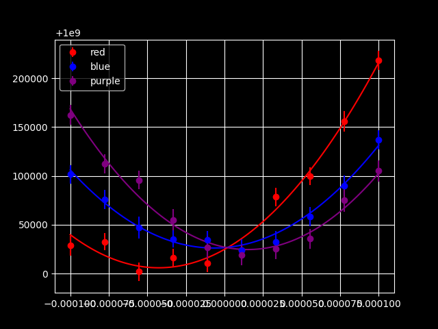
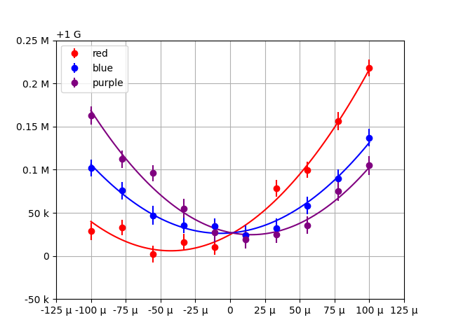

Examples
########

.. module:: sciform
   :noindex:

Test Cases
==========

The :mod:`sciform`
`test suite <https://github.com/jagerber48/sciform/tree/main/tests>`_
contains hundreds of example formatting test cases which showcase the
many available formatting options.

Formatter
=========

Here are a small selection of examples which demonstrate some of the
available formatting options.

>>> from sciform import Formatter
>>> num = 12345.54321
>>> sform = Formatter(exp_mode="scientific", round_mode="sig_fig", ndigits=4)
>>> print(sform(num))
1.235e+04
>>> sform = Formatter(
...     exp_mode="engineering",
...     round_mode="dec_place",
...     ndigits=10,
...     sign_mode=" ",
...     superscript=True,
... )
>>> print(sform(num))
 12.3455432100×10³
>>> sform = Formatter(
...     exp_mode="fixed_point",
...     upper_separator=" ",
...     decimal_separator=",",
...     lower_separator="_",
...     sign_mode="+",
... )
>>> print(sform(num))
+12 345,543_21

>>> num = 0.076543
>>> sform = Formatter(
...     exp_mode="scientific", exp_val=-3, exp_format="parts_per", add_ppth_form=True
... )
>>> print(sform(num))
76.543 ppth
>>> sform = Formatter(
...     exp_mode="scientific", exp_val=-2, exp_format="prefix", add_c_prefix=True
... )
>>> print(sform(num))
7.6543 c
>>> sform = Formatter(exp_mode="scientific", exp_val=-6, exp_format="prefix")
>>> print(sform(num))
76543 μ
>>> sform = Formatter(exp_mode="percent")
>>> print(sform(num))
7.6543%

>>> num = 3141592.7
>>> unc = 1618
>>> sform = Formatter()
>>> print(sform(num, unc))
3141593 ± 1618
>>> sform = Formatter(
...     exp_mode="engineering",
...     exp_format="prefix",
...     pdg_sig_figs=True,
...     pm_whitespace=False,
... )
>>> print(sform(num, unc))
(3.1416±0.0016) M

>>> num = 314159.27
>>> unc = 1618
>>> sform = Formatter(
...     exp_mode="engineering_shifted",
...     pdg_sig_figs=True,
...     paren_uncertainty=True
... )
>>> print(sform(num, unc))
(0.3142(16))e+06

.. _fsml_examples:

Format Specification Mini Language
==================================

>>> from sciform import SciNum
>>> print(f"{SciNum(1234.432):0=+5.6f}")
+001234.432000

In the preceding example ``0=`` indicates that left padding should be
done using ``'0'`` characters.
The ``+`` indicates that a sign symbol should always be displayed.
The ``5`` preceding the round mode symbol (``.``) indicates that the
number should be left padded to the 10\ :sup:`+5` (ten-thousands)
decimal place.
The ``.6`` indicates that the number will be rounded to six digits past
the decimal points.
The ``f`` indicates that the number will be displayed in fixed point
exponent mode.

>>> print(f"{SciNum(123, 0.123):#!2R()}")
(0.12300(12))E+03

In the preceding example the ``#`` alternate flag combined with ``R``
indicates that the number will be formatted in the shifted engineering
exponent mode with a capitalized exponent symbol ``'E'``.
``!2`` indicates that the number will be rounded so that the uncertainty
has two significant figures.
The ``()`` indicates that the value/uncertainty pair should be formatted
using the parentheses uncertainty format.

>>> print(f'{SciNum(123):ex-3p}')
123000 m

In the preceding example the ``e`` indicates that scientific notation
should be used.
The ``x-3`` indicates that the exponent will be forced to equal ``-3``.
Finally the ``p`` indicates that the SI prefix mode should be used.

>>> print(f'{SciNum(123): .-1f}')
 120

In this example the leading space indicates a leading space should be
included for non-negative numbers so that positive and negative numbers
have the same justification.
The ``.-1`` indicates the number should be rounded to one
digit *before* the decimal point and the ``f`` indicates that fixed
point mode should be used.

SciNum, and Global Options
=====================================

Here are a small selection of examples which demonstrate some of the
available string formatting options.
Note that many options are not available through the :ref:`fsml`, so
these options must be selected by configuring the global default options
during formatting.
Here this is done using the :class:`GlobalDefaultsContext` context
manager, but this could have been done using :func:`set_global_defaults`
instead.

>>> from sciform import SciNum, GlobalDefaultsContext
>>> snum = SciNum(12345.54321)
>>> print(f"{snum:!4e}")
1.235e+04
>>> print(f"{snum: .10r}")
 12.3455432100e+03
>>> with GlobalDefaultsContext(
...     upper_separator=" ",
...     decimal_separator=",",
...     lower_separator="_",
... ):
...     print(f"{snum:+}")
+12 345,543_21

>>> snum = SciNum(0.076543)
>>> with GlobalDefaultsContext(exp_format="parts_per", add_ppth_form=True):
...     print(f"{snum:ex-3}")
...
76.543 ppth
>>> with GlobalDefaultsContext(exp_format="prefix", add_c_prefix=True):
...     print(f"{snum:ex-2}")
...
7.6543 c
>>> with GlobalDefaultsContext(exp_mode="scientific", exp_val=-6, exp_format="prefix"):
...     print(f"{snum:ex-6}")
...
76543 μ
>>> print(f"{snum:%}")
7.6543%

>>> num_unc = SciNum(3141592.7, 1618)
>>> print(f"{num_unc}")
3141593 ± 1618
>>> with GlobalDefaultsContext(pdg_sig_figs=True, pm_whitespace=False):
...     print(f"{num_unc:rp}")
...
(3.1416±0.0016) M

>>> num_unc = SciNum(314159.27, 1618)
>>> with GlobalDefaultsContext(pdg_sig_figs=True):
...     print(f"{num_unc:#r()}")
...
(0.3142(16))e+06

Plotting and Tabulating Fit Data
================================

We are given 3 data sets:

.. collapse:: Data

   .. literalinclude:: ../../examples/data/fit_data.json
      :language: json

We want to perform quadratic fits to these data sets, visualize
the results, and print the best fit parameters including the uncertainty
reported by the fit routine.
For these tasks we will require the ``numpy``, ``scipy``,
``matplotlib``, and ``tabulate`` packages.

Without ``sciform``
-------------------

Without ``sciform`` we can perform the fit and plot the data and best
fit lines and print out a table of best fit parameters and
uncertainties:

.. collapse:: Code

   .. literalinclude:: ../../examples/fit_plot_no_sciform.py
      :language: python

This produces the plot:

And the table:

.. literalinclude:: ../../examples/outputs/fit_plot_no_sciform_table.txt
   :language: python

This plot and table suffer from a number of shortcomings which impede
human readability.

- In the table, the exponents for the values and uncertainties differ,
  making it hard to identify the significant digits of the value.
- The number of digits displayed for the values is not correlated with
  the uncertainty for that value. For example, the ``y0`` values are
  shown with precision to the 10\ :sup:`+8` place, but the uncertainty
  indicates precision down to the 10\ :sup:`+3` place.
- In the table, the exponents vary from one dataset to the next. It is
  hard to see these differences at a glance.
- The tick labels on the plot are illegible because each value has so
  many digits.

Of course, even without :mod:`sciform`, it would be possible to make
manual adjustments to the plot and the table to improve these data
visualizations.
However, :mod:`sciform` will allow us to make the required changes in a
general and automated way.

With ``sciform``
----------------

We can address these problems using :mod:`sciform` by:

#. Using prefix scientific notation to label the plot axes.
   This will greatly reduce the number of symbols needed for each tick
   value.
#. Using value/uncertainty formatting in the table to collapse the value
   and error column pairs into individual columns.
   This will make obvious the relative scale between the uncertainty and
   the value.
   Using ``sciform``, the significant digits displayed for the value
   will always match the precision of the uncertainty.
   We will use the parentheses uncertainty format.
#. Using engineering notation for the value/uncertainty in the table. This
   will make the relative scale between different rows obvious.

To do this we import :mod:`sciform` and make some helper functions for
displaying the plot axes as described:

.. collapse:: Code

    .. literalinclude:: ../../examples/fit_plot_with_sciform.py
      :language: python

This produces the plot:

and the table:

.. literalinclude:: ../../examples/outputs/fit_plot_with_sciform_table.txt
   :language: python

We can see the plot and table are immediately much more legible.
Less characters are needed to communicate the data in both
visualizations.
The relative scaling of parameters between datasets and the relative
scaling between the value and uncertainty for each entry are
immediately clear.
