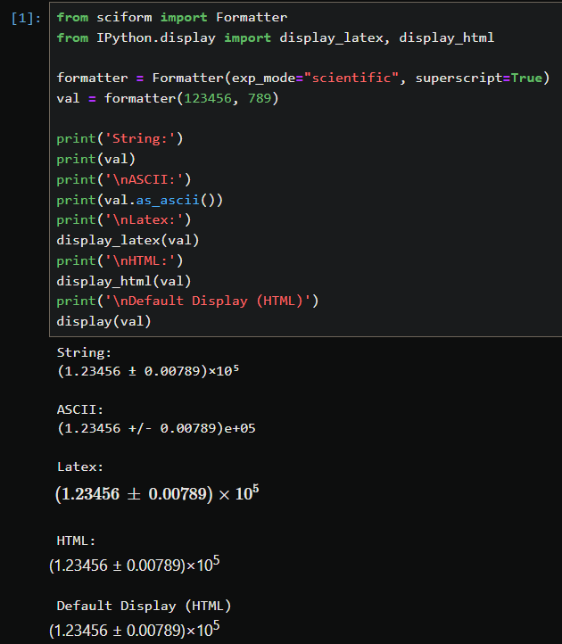

Usage
#####

.. module:: sciform
   :noindex:

Formatting
==========

:mod:`sciform` provides two primary methods for formatting numbers into
scientific formatted strings.
The first is via the :class:`Formatter` object and the second is
using string formatting and the
:ref:`Format Specification Mini-Language (FSML) <fsml>` with the
:class:`SciNum` object.

Formatter
---------

The :class:`Formatter` object is initialized and configured using a
number of formatting options described in :ref:`formatting_options`.
The :class:`Formatter` object is then called with a number and returns
a corresponding formatted string.

>>> from sciform import Formatter
>>> formatter = Formatter(
...     round_mode="dec_place", ndigits=6, upper_separator=" ", lower_separator=" "
... )
>>> print(formatter(51413.14159265359))
51 413.141 593
>>> formatter = Formatter(round_mode="sig_fig", ndigits=4, exp_mode="engineering")
>>> print(formatter(123456.78))
123.5e+03

It is not necessary to provide input for all options.
At format time, any un-populated options will be populated with the
corresponding options from the global options.
See :ref:`global_config` for details about how to view and modify the
global options.

SciNum
------

The :mod:`sciform` :ref:`FSML <fsml>` can be accessed via the
:class:`SciNum` object.
Python numbers specified as :class:`string`, :class:`int`,
:class:`float`, or :class:`Decimal` objects are cast to :class:`SciNum`
objects which can be formatted using the :mod:`sciform`
:ref:`FSML <fsml>`.

>>> from sciform import SciNum
>>> num = SciNum(123456)
>>> print(f"{num:!2f}")
120000

Value/Uncertainty Formatting
----------------------------

One of the most important use cases for scientific formatting is
formatting a value together with its specified uncertainty, e.g.
``84.3 ± 0.2``.
:mod:`sciform` provides the ability to format pairs of numbers into
value/uncertainty strings.
:mod:`sciform` attempts to follow
`BIPM <https://www.bipm.org/documents/20126/2071204/JCGM_100_2008_E.pdf/cb0ef43f-baa5-11cf-3f85-4dcd86f77bd6>`_
or `NIST <https://www.nist.gov/pml/nist-technical-note-1297>`_
recommendations for conventions when possible.

Value/uncertainty pairs can be formatted either by passing two numbers
into a :class:`Formatter`, configured with the corresponding
:ref:`formatting_options` and :ref:`val_unc_formatting_options`, or by
using the :class:`SciNum` object.

>>> val = 84.3
>>> unc = 0.2
>>> formatter = Formatter(ndigits=2)
>>> print(formatter(val, unc))
84.30 ± 0.20
>>> from sciform import SciNum
>>> num = SciNum(val, unc)
>>> print(f"{num:!2}")
84.30 ± 0.20

Value/uncertainty pairs can also be formatted using a parentheses
notation in which the uncertainty is displayed in parentheses following
the value.
See
`BIPM Guide Section 7.2.2 <https://www.bipm.org/documents/20126/2071204/JCGM_100_2008_E.pdf/cb0ef43f-baa5-11cf-3f85-4dcd86f77bd6#page=37>`_.

>>> print(f"{num:!2()}")
84.30(20)

Value/uncertainty pairs are formatted according to the following
algorithm:

#. Rounding is always performed using significant figure rounding
   applied to the uncertainty.
   See :ref:`rounding` for more details about possible rounding options.
#. The value is rounded to the decimal place corresponding to the least
   significant digit of the rounded uncertainty.
#. The value for the exponent is resolved by using ``exp_mode`` and
   ``exp_val`` with the larger of the value or uncertainty.
#. The value and uncertainty mantissas are determined according to the
   value of the exponent determined in the previous step.
#. The value and uncertainty mantissas are formatted together with the
   exponent according to other user-selected display options.

.. _formatted_input:

Formatted Input
---------------

Both the :class:`Formatter` format function and :class:`SciNum`
constructor accept :class:`str`, :class:`int`, :class:`float`, and
:class:`Decimal` input for the value and optionally accept the same
types for the uncertainty.

>>> from decimal import Decimal
>>> from sciform import Formatter
>>>
>>> formatter = Formatter(ndigits=4)
>>> print(formatter("32", "9"))
32.000 ± 9.000
>>> print(formatter(32, 9))
32.000 ± 9.000
>>> print(formatter(32.00, 9.00))
32.000 ± 9.000
>>> print(formatter(Decimal("32.000"), Decimal("9.000")))
32.000 ± 9.000

These example strings can be natively cast to numeric types like
:class:`int`, :class:`float`, or :class:`Decimal`.
However, :class:`Formatter` and :class:`SciNum` also accept
formatted strings which contain the numeric information, but with more
sophisticated formatting.

>>> print(formatter("+  123_456,789 987 n"))
0.0001235

Here the string ``"+  123_45,789 987 n"`` is re-interpreted by the
:class:`Formatter` as the number ``12345.789987e-09``.
The ``e-09`` arises as the reverse translation of the SI "nano" prefix
``n``.
When this is formatted in fixed point mode with 4 significant digits the
result is ``"0.0001235"``.

Instead of passing in two inputs, one representing the value and one
representing the uncertainty, it is possible to pass in one input which
contains information about both the value and the uncertainty.

>>> print(formatter("(123.0 ± 0.4) m"))
0.1230000 ± 0.0004000
>>> print(formatter("(123 +/- 0.4) m"))
0.1230000 ± 0.0004000

Note that the first example input string is an example :mod:`sciform`
output string that would have resulted from various options and inputs
while the second example input string is not an example :mod:`sciform`
output string.
Any :mod:`sciform` output string can also be used as an input string.
However, some input strings can be supplied which are not valid
:mod:`sciform` outputs.

  * For inputs, it is not necessary that the value and uncertainty are
    expressed to the same lowest decimal place.
    By contrast, :mod:`sciform` outputs will always format the value and
    uncertainty to the same lowest decimal place.
  * For inputs, the ASCII ``+/-`` symbols may be used to separate the
    value from the uncertainty.
    By contrast, :mod:`sciform` will always use the Unicode ``±`` symbol
    for direct outputs (noting that the ``±`` symbol can be converted
    into ``+/-`` afterwards using :meth:`FormattedNumber.as_ascii`, see
    :ref:`output_conversion`).

Note that the formatting of the input strings has no bearing on the
formatting of the resulting outputs.

Like :mod:`sciform` outputs, the input value/uncertainty pairs must
always share the exponent string.

.. doctest::
  :options: -IGNORE_EXCEPTION_DETAIL

  >>> print(formatter("(1.2 +/- 0.1)e+03"))
  1200.0 ± 100.0
  >>> print(formatter("1.2e+03 +/- 0.1e+03"))
  Traceback (most recent call last):
    ...
  ValueError: Input string "1.2e+03 +/- 0.1e+03" does not match any expected input format.

Inputs can use parentheses uncertainty notation and will be
interpreted using the following rules.

  * The value string will always be directly converted to a float.
  * If the uncertainty string contains a decimal symbol then it will be
    directly converted to a float.
  * If the value string contains a decimal symbol but the uncertainty
    string does not then the string is parsed according to trimmed
    parentheses notation.
    In this case the uncertainty is left padded with a leading ``"0."``
    and then a sufficient number of zeros so that the least significant
    digit of the uncertainty matches the least significant digit of the
    value.

    * If the uncertainty contains more digits than appear in the
      fractional part of the value then this padding is impossible and
      it is not clear what the value of the uncertainty is.
      In this case an exception is raised.

.. doctest::
  :options: -IGNORE_EXCEPTION_DETAIL

  >>> print(formatter("1(100)"))
  1.0 ± 100.0
  >>> print(formatter("123.4(5.42)"))
  123.400 ± 5.420
  >>> print(formatter("123.4(5)"))
  123.4000 ± 0.5000
  >>> print(formatter("123.4(56)"))
  Traceback (most recent call last):
    ...
  ValueError: Invalid value/uncertainty pair for parentheses uncertainty: "123.4(56)". If a decimal symbol appears in the value but not in the uncertainty then the number of the digits in the uncertainty may not exceed the number of digits in the fractional part of the value.

If the input string contains information about the uncertainty then a
second argument, which would otherwise specify the uncertainty, is not
allowed

.. doctest::
  :options: -IGNORE_EXCEPTION_DETAIL

  >>> print(formatter("123(4)", 4))
  Traceback (most recent call last):
    ...
  ValueError: Value input string "123(4)" already includes an uncertainty, (4). It is not possible to also pass in an uncertainty (4) directly.

As demonstrated above, the input string parser can parse translated
exponents such as ``"n" -> "e-09"``.
These translations are performed by first checking the default SI
prefixes along with any global ``extra_si_prefixes``, then checking
the default parts-per forms along with any global
``extra_parts_per_forms``, then checking the default IEC prefixes along
with any global ``extra_iec_prefixes``.
If an IEC prefix is detected then the exponent base is chosen to be 2.
if no valid translations are discovered or more than one valid
translation is discovered an exception is raised.

.. doctest::
  :options: -IGNORE_EXCEPTION_DETAIL

  >>> from sciform import GlobalOptionsContext
  >>> formatter = Formatter()
  >>> with GlobalOptionsContext(add_c_prefix=True):
  ...     print(formatter("32 c"))
  0.32
  >>> print(formatter("32 c"))
  Traceback (most recent call last):
    ...
  ValueError: Unrecognized prefix: "c". Unable to parse input.
  >>> with GlobalOptionsContext(extra_si_prefixes={-12: "ppb"}):
  ...     print(formatter("42 ppb"))
  Traceback (most recent call last):
    ...
  ValueError: Multiple translations found for "ppb": [-12, -9]. Unable to parse input.

In the final example, the SI translation for an exponent of ``-12`` was
re-mapped to ``"ppb"`` according to the "long scale" definition of
billion.
This collides with the "short scale" definition of billion that maps
``-9`` to ``"ppb"`` as a default parts per form.
This issue could be corrected as follows.

>>> with GlobalOptionsContext(
...     exp_mode="engineering",
...     extra_parts_per_forms={-9: None, -12: "ppb"}
... ):
...     print(formatter("42 ppb"))
42e-12

In most cases the parser can determine whether the decimal symbol is
``"."`` or ``","``.

  * If both ``"."`` and ``","`` appear in a formatted value then
    whichever comes earlier must be the upper separator and whichever
    comes later must be the lower separator. E.g. ``123.456,789`` must
    have ``","`` as the decimal separator.
  * If one separator appears more than once it must be the upper
    separator. E.g. ``123,456,789`` must have ``"."`` as the decimal
    separator.
  * If one separator appears once but it is preceded by more than 3
    digits, or it is followed by any number of digits other than 3, then
    that separator must be the decimal separator. E.g. in both
    ``1234.567`` and ``12.3`` we must have that ``"."`` is the decimal
    separator.
  * In some cases the decimal separator cannot be determined, e.g.
    ``123456``, ``123,456``, ``12.345``.

:mod:`sciform` first tries to infer the decimal separator from the
both the value and the uncertainty.
If these inferences are successful and disagree then an exception is
raised.
If the inferences agree or only one succeeds then the succeeding result
is selected as the decimal separator.
If neither inference is successful then the decimal separator is
selected either from the populated options on the local
:class:`Formatter` or from the global options.

.. doctest::
  :options: -IGNORE_EXCEPTION_DETAIL

  >>> formatter = Formatter(decimal_separator=".")
  >>> print(formatter("1234,567"))
  1234.567
  >>> print(formatter("123,45"))
  123.45
  >>> print(formatter("123,45 +/- 345.578"))
  123 ± 345578
  >>> print(formatter("12.45 +/- 2,34"))
  Traceback (most recent call last):
    ...
  ValueError: Value "12.45" and uncertainty "2,34" have different decimal separators.
  >>> formatter = Formatter(decimal_separator=",")
  >>> print(formatter("123,456"))
  123,456
  >>> formatter = Formatter()
  >>> with GlobalOptionsContext(decimal_separator=","):
  ...     print(formatter("123,456"))
  123,456

The same parsing rules apply to :class:`SciNum` construction

>>> print(f'{SciNum("+  123_456,789 987 n"):!4f}')
0.0001235
>>> print(f'{SciNum("(123.0 ± 0.4) m"):!4f}')
0.1230000 ± 0.0004000
>>> print(f'{SciNum("(123 +/- 0.4) m"):!4f}')
0.1230000 ± 0.0004000
>>> print(f'{SciNum("123(4)")}')
123 ± 4

.. _output_conversion:

Output Conversion
=================

Typically the output of the :class:`Formatter` is used as a regular
python string.
However, the :class:`Formatter` returns a :class:`FormattedNumber`
instance.
The :class:`FormattedNumber` class
subclasses :class:`str` and in many cases is used like a normal python
string.
However, the :class:`FormattedNumber` class
exposes methods to convert the standard string representation into
LaTeX, HTML, or ASCII representations.
The LaTeX and HTML representations may be useful when :mod:`sciform`
outputs are being used in contexts outside of e.g. text terminals such
as `Matplotlib <https://matplotlib.org/>`_ plots,
`Jupyter <https://jupyter.org/>`_ notebooks, or
`Quarto <https://quarto.org/>`_ documents which support richer display
functionality than Unicode text.
The ASCII representation may be useful if :mod:`sciform` outputs are
being used in contexts in which only ASCII, and not Unicode, text is
supported or preferred.

These conversions can be accessed via the
:meth:`FormattedNumber.as_latex`,
:meth:`FormattedNumber.as_html`, and
:meth:`FormattedNumber.as_ascii` methods on the
:class:`FormattedNumber` class.

>>> formatter = Formatter(
...     exp_mode="scientific",
...     exp_val=-1,
...     upper_separator="_",
...     superscript=True,
... )
>>> formatted = formatter(12345)
>>> print(f"{formatted} -> {formatted.as_latex()}")
123_450×10⁻¹ -> $123\_450\times10^{-1}$
>>> print(f"{formatted} -> {formatted.as_html()}")
123_450×10⁻¹ -> 123_450×10-1
>>> print(f"{formatted} -> {formatted.as_ascii()}")
123_450×10⁻¹ -> 123_450e-01

>>> formatter = Formatter(
...     exp_mode="percent",
...     lower_separator="_",
... )
>>> formatted = formatter(0.12345678, 0.00000255)
>>> print(f"{formatted} -> {formatted.as_latex()}")
(12.345_678 ± 0.000_255)% -> $(12.345\_678\:\pm\:0.000\_255)\%$
>>> print(f"{formatted} -> {formatted.as_html()}")
(12.345_678 ± 0.000_255)% -> (12.345_678 ± 0.000_255)%
>>> print(f"{formatted} -> {formatted.as_ascii()}")
(12.345_678 ± 0.000_255)% -> (12.345_678 +/- 0.000_255)%

>>> formatter = Formatter(exp_mode="engineering", exp_format="prefix", ndigits=4)
>>> formatted = formatter(314.159e-6, 2.71828e-6)
>>> print(f"{formatted} -> {formatted.as_latex()}")
(314.159 ± 2.718) μ -> $(314.159\:\pm\:2.718)\:\text{\textmu}$
>>> print(f"{formatted} -> {formatted.as_html()}")
(314.159 ± 2.718) μ -> (314.159 ± 2.718) μ
>>> print(f"{formatted} -> {formatted.as_ascii()}")
(314.159 ± 2.718) μ -> (314.159 +/- 2.718) u

The LaTeX enclosing ``"$"`` math environment symbols can be optionally
stripped:

>>> formatter = Formatter(exp_mode="engineering", exp_format="prefix", ndigits=4)
>>> formatted = formatter(314.159e-6, 2.71828e-6)
>>> print(f"{formatted} -> {formatted.as_latex(strip_math_mode=False)}")
(314.159 ± 2.718) μ -> $(314.159\:\pm\:2.718)\:\text{\textmu}$
>>> print(f"{formatted} -> {formatted.as_latex(strip_math_mode=True)}")
(314.159 ± 2.718) μ -> (314.159\:\pm\:2.718)\:\text{\textmu}

In addition to exposing
:meth:`FormattedNumber.as_latex` and
:meth:`FormattedNumber.as_html`,
the :class:`FormattedNumber` class defines
the aliases
:meth:`FormattedNumber._repr_latex_` and
:meth:`FormattedNumber._repr_html_`.
The
`IPython display functions <https://ipython.readthedocs.io/en/stable/api/generated/IPython.display.html#functions>`_
looks for these methods, and, if available, will use them to display
prettier representations of the class than the Unicode ``__repr__``
representation.
Here is example :class:`FormattedNumber` usage in a Jupyter notebook.

.. _global_config:

Global Options
==============

It is possible to modify the global options for :mod:`sciform` to avoid
repetition of verbose configuration options or format specification
strings.
When the user creates a :class:`Formatter` object or formats a string
using the :ref:`FSML <fsml>`, they typically do not specify settings for
all available options.
In these cases, the unpopulated options resolve their values from the
global options at format time.

The :mod:`sciform` default global options can be viewed using
:func:`get_default_global_options`

>>> from sciform import get_default_global_options
>>> print(get_default_global_options())
PopulatedOptions(
 'exp_mode': 'fixed_point',
 'exp_val': AutoExpVal,
 'round_mode': 'sig_fig',
 'ndigits': AutoDigits,
 'upper_separator': '',
 'decimal_separator': '.',
 'lower_separator': '',
 'sign_mode': '-',
 'left_pad_char': ' ',
 'left_pad_dec_place': 0,
 'exp_format': 'standard',
 'extra_si_prefixes': {},
 'extra_iec_prefixes': {},
 'extra_parts_per_forms': {},
 'capitalize': False,
 'superscript': False,
 'nan_inf_exp': False,
 'paren_uncertainty': False,
 'pdg_sig_figs': False,
 'left_pad_matching': False,
 'paren_uncertainty_trim': True,
 'pm_whitespace': True,
)

The global options can be modified using the :func:`set_global_options`
function.
Any options passed will overwrite the corresponding options in the
current global options and any unfilled options will remain unchanged.
The current global options can be viewed using
:func:`get_global_options`.
The global options can be reset to the :mod:`sciform` default global
options using :func:`reset_global_options`.

>>> from sciform import set_global_options, get_global_options, reset_global_options
>>> set_global_options(
...     left_pad_char="0",
...     exp_mode="engineering_shifted",
...     ndigits=4,
...     decimal_separator=",",
... )
>>> print(get_global_options())
PopulatedOptions(
 'exp_mode': 'engineering_shifted',
 'exp_val': AutoExpVal,
 'round_mode': 'sig_fig',
 'ndigits': 4,
 'upper_separator': '',
 'decimal_separator': ',',
 'lower_separator': '',
 'sign_mode': '-',
 'left_pad_char': '0',
 'left_pad_dec_place': 0,
 'exp_format': 'standard',
 'extra_si_prefixes': {},
 'extra_iec_prefixes': {},
 'extra_parts_per_forms': {},
 'capitalize': False,
 'superscript': False,
 'nan_inf_exp': False,
 'paren_uncertainty': False,
 'pdg_sig_figs': False,
 'left_pad_matching': False,
 'paren_uncertainty_trim': True,
 'pm_whitespace': True,
)
>>> reset_global_options()

The global options can be temporarily modified using the
:class:`GlobalOptionsContext` context manager.
The context manager is configured using the same options as
:class:`Formatter` and :func:`set_global_options`.
Within the context of :class:`GlobalOptionsContext` manager, the
global options take on the specified input settings, but when the
context is exited, the global options revert to their previous values.

>>> from sciform import GlobalOptionsContext, SciNum
>>> num = SciNum(0.0123)
>>> print(f"{num:.2ep}")
1.23e-02
>>> with GlobalOptionsContext(add_c_prefix=True):
...     print(f"{num:.2ep}")
1.23 c
>>> print(f"{num:.2ep}")
1.23e-02

Note that the :ref:`FSML <fsml>` does not provide complete control over
all possible format options.
For example, there is no code in the :ref:`FSML <fsml>` for configuring
the ``pdg_sig_figs`` option.
If the user wishes to configure these options, but also use the
:ref:`FSML <fsml>`, then they must do so by modifying the global
options.

Formatter Options
=================

The :class:`Formatter` options are configured by constructing a
:class:`Formatter` and passing in keyword arguments corresponding to the
desired options.
Only a subset of available options need be specified.
The user input during :class:`Formatter` construction can be viewed
using the :attr:`Formatter.input_options` property.

>>> formatter = Formatter(
...     exp_mode="engineering",
...     round_mode="sig_fig",
...     ndigits=2,
...     superscript=True,
... )
>>> print(formatter.input_options)
InputOptions(
 'exp_mode': 'engineering',
 'round_mode': 'sig_fig',
 'ndigits': 2,
 'superscript': True,
)

The :attr:`Formatter.input_options` property is a :class:`InputOptions`
instance.
The string representation of this object indicates the explicitly
populated options.
A dictionary of these populated options is available via the
:meth:`InputOptions.as_dict` method.

>>> print(formatter.input_options.as_dict())
{'exp_mode': 'engineering', 'round_mode': 'sig_fig', 'ndigits': 2, 'superscript': True}

Both populated and unpopulated options can be accessed by direct
attribute access.

>>> print(formatter.input_options.round_mode)
sig_fig
>>> print(formatter.input_options.exp_format)
None

In addition to viewing the user input options, it is possible to preview
the result of populating the unpopulated options with the corresponding
global options by using the :attr:`Formatter.populated_options`
property.

>>> print(formatter.populated_options)
PopulatedOptions(
 'exp_mode': 'engineering',
 'exp_val': AutoExpVal,
 'round_mode': 'sig_fig',
 'ndigits': 2,
 'upper_separator': '',
 'decimal_separator': '.',
 'lower_separator': '',
 'sign_mode': '-',
 'left_pad_char': ' ',
 'left_pad_dec_place': 0,
 'exp_format': 'standard',
 'extra_si_prefixes': {},
 'extra_iec_prefixes': {},
 'extra_parts_per_forms': {},
 'capitalize': False,
 'superscript': True,
 'nan_inf_exp': False,
 'paren_uncertainty': False,
 'pdg_sig_figs': False,
 'left_pad_matching': False,
 'paren_uncertainty_trim': True,
 'pm_whitespace': True,
)

The :attr:`Formatter.populated_options` property is a
:class:`PopulatedOptions` instance.
It is recalculated each time the property is accessed so that the output
always reflects the current global options.
Like the :class:`InputOptions` class, the :class:`PopulatedOptions`
class provides access to its options via direct attribute access and via
a :meth:`PopulatedOptions.as_dict` method.

The :class:`FormattedNumber` class stores a record of the
:class:`PopulatedOptions` that were used to generate it.

>>> formatter = Formatter(
...     exp_mode="engineering",
...     round_mode="sig_fig",
...     ndigits=2,
...     superscript=True,
... )
>>> formatted = formatter(12345.678, 3.4)
>>> print(formatted)
(12.3457 ± 0.0034)×10³
>>> print(formatted.populated_options)
PopulatedOptions(
 'exp_mode': 'engineering',
 'exp_val': AutoExpVal,
 'round_mode': 'sig_fig',
 'ndigits': 2,
 'upper_separator': '',
 'decimal_separator': '.',
 'lower_separator': '',
 'sign_mode': '-',
 'left_pad_char': ' ',
 'left_pad_dec_place': 0,
 'exp_format': 'standard',
 'extra_si_prefixes': {},
 'extra_iec_prefixes': {},
 'extra_parts_per_forms': {},
 'capitalize': False,
 'superscript': True,
 'nan_inf_exp': False,
 'paren_uncertainty': False,
 'pdg_sig_figs': False,
 'left_pad_matching': False,
 'paren_uncertainty_trim': True,
 'pm_whitespace': True,
)

Formatter Options Edge Cases
----------------------------

In most cases, at format/option population time, any non-``None`` options
in the :class:`InputOptions` will be exactly copied over to the
:class:`PopulatedOptions` and any ``None`` options will be exactly copied
over from the global options at format time.
However, a few options have slightly more complicated behavior.

>>> from sciform import set_global_options, get_global_options, reset_global_options
>>> set_global_options(extra_si_prefixes={-2: "cm"})
>>> print(get_global_options().extra_si_prefixes)
{-2: 'cm'}
>>> formatter = Formatter(add_c_prefix=True)
>>> print(formatter.input_options.extra_si_prefixes)
None
>>> print(formatter.populated_options.extra_si_prefixes)
{-2: 'c'}
>>> reset_global_options()

Somewhat surprisingly, even though ``extra_si_prefixes`` is unpopulated
in the :class:`Formatter`, it does not get populated with the
corresponding global options ``extra_si_prefixes``.
This is because the :class:`Formatter` has ``add_c_prefix=True``.
If ``extra_si_prefixes=None`` but ``add_c_prefix=True`` then the same
population behavior as if ``extra_si_prefixes={-2: 'c'}`` is realized.
If ``extra_si_prefixes`` is a dictionary then ``{-2: 'c'}`` is added to
the dictionary if ``-2`` is not already a key in the dictionary.
If ``-2`` already appears in the dictionary then its value is not
overwritten.

>>> set_global_options(extra_si_prefixes={-2: "cm"})
>>> print(get_global_options().extra_si_prefixes)
{-2: 'cm'}
>>> formatter = Formatter(extra_si_prefixes={-15: 'fermi'}, add_c_prefix=True)
>>> print(formatter.input_options.extra_si_prefixes)
{-15: 'fermi'}
>>> print(formatter.populated_options.extra_si_prefixes)
{-15: 'fermi', -2: 'c'}
>>> reset_global_options()

>>> formatter = Formatter(extra_si_prefixes={-2: 'cm'}, add_c_prefix=True)
>>> print(formatter.input_options.extra_si_prefixes)
{-2: 'cm'}
>>> print(formatter.populated_options.extra_si_prefixes)
{-2: 'cm'}
>>> reset_global_options()

Analogous behavior occurs for the ``add_small_si_prefixes`` and
``add_ppth_form`` :class:`Formatter` options.
Note also that these three options, ``add_c_prefix``,
``add_small_si_prefixes``, and ``add_ppth_form`` appear in the
:class:`InputOptions` instance if they have been explicitly set, but
they never appear in the :class:`PopulatedOptions` instance.
Rather, only the populated ``extra_si_prefixes`` or
``extra_parts_per_forms`` are appropriately populated.

Finally, if integer ``0`` is passed into ``left_pad_char`` then
integer ``0`` will be stored in the :class:`InputOptions`, but it will
be converted to string ``"0"`` in the :class:`PopulatedOptions`.

>>> formatter = Formatter(left_pad_char=0)
>>> print(type(formatter.input_options.left_pad_char))
<class 'int'>
>>> print(type(formatter.populated_options.left_pad_char))
<class 'str'>

.. _dec_and_float:

Note on Decimals and Floats
===========================

Numerical data can be stored in Python
`float <https://docs.python.org/3/library/functions.html#float>`_
or
`Decimal <https://docs.python.org/3/library/decimal.html>`_ objects.
:class:`float` instances represent numbers using binary which means
they are often only approximations of the decimal numbers users have in
mind when they use :class:`float`.
By contrast, :class:`Decimal` objects store sequences of integers
representing the decimal digits of the represented numbers so,
:class:`Decimal` instances are, therefore, exact representations of
decimal numbers.

Both of these representations have finite precision which can cause
unexpected issues when manipulating numerical data.
However, in the :class:`Decimal` class, the main issue is that
numbers may be truncated if their precision exceeds the configured
:class:`Decimal` precision, but the rounding will be as expected.
That said, the precision used for :class:`Decimal` numbers can
easily be modified if necessary.
:class:`float` instances, unfortunately, may exhibit more surprising
behavior, as will be explained below.
For these reasons, the :mod:`sciform` module uses :class:`Decimal`
representations in its internal formatting algorithms.

Note, however, that :class:`Decimal` arithmetic operations are less
performant that :class:`float` operations.
So, unless very high precision is needed at all steps of the
calculation, the suggested workflow is to store and manipulate numerical
data as :class:`float` instances, and only convert to :class:`Decimal`,
or format using :mod:`sciform`, as the final step when numbers are being
displayed for human readers.

.. _float_issues:

Float Issues
------------

Here we would like to highlight some important facts and possible issues
with :class:`float` objects that users should be aware of if they are
concerned with the exact decimal representation of their numerical data.

* Python uses
  `double-precision floating-point format <https://en.wikipedia.org/wiki/Double-precision_floating-point_format>`_
  for its :class:`float`.
  In this format, a :class:`float` occupies 64 bits of memory: 52 bits
  for the mantissa, 11 bits for the exponent and 1 bit for the sign.
* Any decimal with 15 digits between about ``± 1.8e+308`` can be
  uniquely represented by a :class:`float`.
  However, two decimals with more than 15 digits may map to the same
  :class:`float`.
  For example,
  ``float(8.000000000000001) == float(8.000000000000002)`` returns
  ``True``.
  See `"Decimal Precision of Binary Floating Point Numbers" <https://www.exploringbinary.com/decimal-precision-of-binary-floating-point-numbers/>`_
  for more details.

* If any :class:`float` is converted to a decimal with at least 17
  digits then it will be converted back to the same :class:`float`.
  See `"The Shortest Decimal String that Round-Trips: Examples" <https://www.exploringbinary.com/the-shortest-decimal-string-that-round-trips-examples/>`_
  for more details.
  However, many :class:`float` instances can be "round-tripped" with
  far fewer digits.
  The :func:`__repr__` for the python :class:`float` class converts the
  :class:`float` to a string decimal representation with the minimum
  number of digits such that it round trips to the same :class:`float`.
  For example we can see the exact decimal representation of the
  :class:`float` which ``0.1`` is mapped to:
  ``print(Decimal(float(0.1)))`` gives
  ``"0.1000000000000000055511151231257827021181583404541015625"``.
  However ``print(float(0.1))`` just gives ``"0.1"``.
  That is,
  ``0.1000000000000000055511151231257827021181583404541015625`` and
  ``0.1`` map to the same :class:`float` but the :class:`float`
  :func:`__repr__()` algorithm presents us with the shorter (more
  readable) decimal representation.

The `python documentation <https://docs.python.org/3/tutorial/floatingpoint.html#tut-fp-issues>`_
goes into some detail about possible issues one might encounter when
working with :class:`float` instances.
Here we would like to highlight two specific issues.

#. **Rounding**.
   `Python's round() function <https://docs.python.org/3/library/functions.html#round>`_
   uses a `"round-to-even" or "banker's rounding" <https://en.wikipedia.org/wiki/Rounding#Rounding_half_to_even>`_
   strategy in which ties are rounded so the least significant digit
   after rounding is always even.
   This ensures data sets with uniformly distributed digits are not
   biased by rounding.
   Rounding of :class:`float` instances may have surprising results.
   Consider the decimal numbers ``0.0355`` and ``0.00355``.
   If we round these to two significant figures using a "round-to-even"
   strategy, we expect the results ``0.036`` and ``0.0036``
   respectively.
   However, if we try to perform this rounding for :class:`float` we get
   an unexpected result. We see that ``round(0.00355, 4)`` gives
   ``0.0036`` as expected but ``round(0.0355, 3)`` gives ``0.035``.
   We can see the issue by looking at the decimal representations of the
   corresponding :class:`float` instances.
   ``print(Decimal(0.0355))`` gives
   ``"0.035499999999999996835864379818303859792649745941162109375"``
   which indeed should round down to ``0.035`` while
   ``print(Decimal(0.00355))`` gives
   ``"0.003550000000000000204003480774872514302842319011688232421875"``
   which should round to ``0.0036``.
   So, we see that the rounding behavior for :class:`float` may depend on
   digits of the decimal representation of the :class:`float` which are
   beyond the minimum number of digits necessary for the :class:`float`
   to round trip and, thus, beyond the number of digits that will be
   displayed by default.
#. **Representation of numbers with high precision**.
   Conservatively, :class:`float` provides 15 digits of precision.
   That is, any two decimal numbers (within the :class:`float` range)
   with 15 or fewer digits of precision are guaranteed to correspond to
   unique :class:`float` instances.
   Decimal numbers with 16 digits or more of precision may not
   correspond to unique :class:`float` instances.
   It is rare, in scientific applications, that we require more than 15
   digits of precision, but in some cases we do.
   One example is precision frequency metrology, such as that
   involved in atomic clocks.
   The relative uncertainty of primary frequency standards is
   approaching one part in 10\ :sup:`-16`.
   This means that measured quantities may require up to 16 digits to
   display.
   Indeed, consider
   `Metrologia 55 (2018) 188–200 <https://iopscience.iop.org/article/10.1088/1681-7575/aaa302>`_.
   In Table 2 the :sup:`87` Rb ground-state hyperfine splitting is cited
   as ``6 834 682 610.904 312 6 Hz`` with 17 digits. Suppose the last
   digit was a ``5`` instead of a ``6``. Python :class:`float` cannot
   tell the difference:
   ``float(6834682610.9043126) == float(6834682610.9043125)`` returns
   ``True``.

How :mod:`sciform` Handles Decimals and Floats
----------------------------------------------

To support predictable rounding and the representation of high precision
numbers, :mod:`sciform` casts the numbers it is presenting to
:class:`Decimal` objects during its formatting algorithm.
Numbers are input into :mod:`sciform` either as the input to a
:class:`Formatter` or when instantiating a :class:`SciNum` object.
In all cases the input will typically be a :class:`Decimal`,
:class:`float`, :class:`str`, or :class:`int`.
:class:`Decimal`, :class:`str` and :class:`int` are unambiguously
converted to :class:`Decimal` objects.
For :class:`float` inputs, the values are first cast to :class:`str`
instances to get their shortest round-trippable decimal representations.
These shortest round-trippable strings are then converted into
:class:`Decimal` instances.
For high precision applications it is recommended that users provide
input to :mod:`sciform` either as :class:`str` or :class:`Decimal`.
